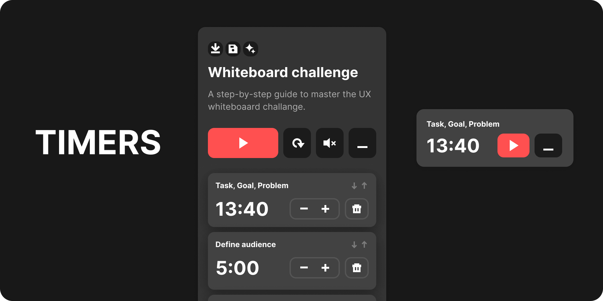

# Timers for Figma

The plugin allows setting up multiple timers as a single flow.

- Use and create your own templates
- save and load timers configurations as a JSON file
- minimized version supported
- timers mute and reordering
- autosaving to storage after you close the plugin.

### 🤖 [Install plugin](https://www.figma.com/community/plugin/1053689497185030696/Timers)

---

## Templates

Timers use Github to store templates, so if you want to add your configurations, you can do it via Github and create a pull request.

### 👉 [Templates branch](https://github.com/PavelLaptev/figma-timers/tree/configs)
